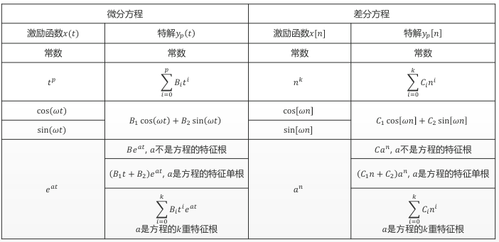

# 系统的时域分析

**如何分析系统**（输出的变化）
1. 利用冲击信号进行探索(卷积)
2. 通过递推公示得到明确表达式

## 系统

#### 模型描述

- 输入输出描述：N 阶的微分或者差分方程描述
- 状态空间描述：N个一阶的微分或者差分
- 方框图描述：找到某个点建立等式

#### 系统分类

- 因果系统：当且仅当输入信号激励系统时才有输出响应的系统，$y(t)$ 不会依赖于 $x(t+1)$ 的未来的输入 ($t$ 的输出之和之前的以及$t$ 时刻的**输入**有关)
- 稳定系统：在微小的输入下的响应不会发散(对任意输出都有界)
- 线性系统：**齐次性、可加性**
    $$
        x_1(t)\to y_1(t), x_2(t)\to y_2(t)\\
        \alpha x_1(t) + \beta x_2(t) \to \alpha y_1(t) + \beta y_2(t)
    $$
- 时不变系统：输出的响应与输入的关系不随输入激励的时间起点而改变， $x(t) \to y(t), x(t+t_0) \to y(t+t_0)$
    > 线性时不变系统可以用一个常系数的微分或者差分方程表示

## 卷积

卷积和: $y[n] = \sum_{k=-\infty}^{\infty}x[k]h[n-k]$ 
> 其中，$h[x]$ 具有时不变性质及 $h_k[n] = h[n - k]$
>> 给人的感觉就是卷积就是对于一段时间范围的响应求和
>
> 或者理解为一个把 $x[0]$ 相对于 $h[n]$ 对齐后求一个交叉的乘积和 
> 或者是把 $h[n-k]\to h[n+k]$ 之间的一段信号在 $x[n]$ 上游走作积取值的感觉

#### 卷积的计算

1. 把 $x[n], h[n]$ 中的自由变量由 $n$ 变为 $k$
2. $h[k] \to h[-k] \to h[-(k-n)] = h[n-k]$
3. 计算卷积和
4. 平移$n$, 计算$x[k]h[n-k]$在所有的$k$上的求和

- 表格计算法

- 矩阵计算法

#### 卷积的性质

- 交换律、分配律、结合律
- 平移特性：$x_1(t) * x_2(t) \to y(t)$, 则有 $x_1(t-t_1)*x_2(t-t_2) \to y(t -t_1-t_2)$
- 展缩特性： $x_1(t) * x_2(t) = y(t)$
  $$
    x_1(at)*x_2(at) = \frac{1}{|a|}y(at)
  $$
- 微积分
  - 微分： $\frac{d}{dt}[x_1(t)*x_2(t)] = x_1(t) * \frac{d}{dt}x_2(t) = \frac{d}{dt}x_1(t)*x_2(t) $ 
  - 积分：$\int_{-\infty}^{t}[x_1(t) * x_2(t)]dt = \int_{-\infty}^{t}[x_1(t)]dt*x_2(t) = x_1(t)*\int_{-\infty}^{t}[x_2(t)]dt$

  **等效特性**： $y^{(i)}(t) = x_1^{(j)}(t) * x_2^{(i-j)}(t)$

**一些推论(奇异信号的卷积)**

- $\delta(t) * \delta(t) = \delta(t)$
- $x(t) * \delta(t-T) = x(t-T) $
- $x(t) * \delta^{'}(t) = x^{'}(t)$
- $u(t) * u(t) = \int_{\infty}^tu(\tau)d\tau = tu(t)$ 
- $x(t) * u(t) = \int_{-\infty}^tx(\tau)d\tau = x^{(-1)}(t)$
- 
  $$
    \begin{aligned}
      x_1(t) * x_2(t) &= x_1^{(-1)}(t) * x_2'(t)\\
        &= x_1'(t) * x_2^{(-1)}(t)\\
        &= [x_1'(t) * x_2(t)]^{(-1)}
    \end{aligned}
  $$
  
> $x(-1)(t)$ 积分， $x(1)(t)$ 一阶导

卷积的计算带来的现象
|$x(t) * \dots$| |
|-|-|
|$u(t)$ | 积分 |
|$\delta(t)$ | 直通 |
|$\delta(t-T_0)$ | 延时 |

##### 卷积和性质

- $$
    \nabla x[n] * h[n] = x[n] * \nabla h[n] = \nabla y[n]
  $$
- $$
    x[n] * \sum_{k=-\infty}^n h[k] = \left(\sum_{k=\infty}^n x[k]\right)*h[n] = \sum_{k=-\infty}^n y[k]
  $$

##### 卷积分析系统

- 集联: $x(t) \overset{*h_1(t)}{\to} z(t) \overset{*h_2(t)}{\to} y(t)$, 即有 $x(t) \overset{*(h_1(t) * h_2(t))}{\to} y(t)$
- 并联：...

LTI(Linear time-invariant system) 因果的**充分必要**
  - $h(t) = 0,\, t<0$
  - $h[n] = n,\, n<0$

因果系统需要$y[n]$ 与 $x[n + k],\, k > 0$ 无关，也即 $x[k]\delta[n-k]$ 中 $when k > n 均为 0$, 则结论易见

LTI 为稳定的的**充分必要**：
  - $\int_{-\infty}^{\infty} |h(\tau)| d\tau < \infty$
  - $\sum_{-\infty}^{\infty} |h[k]| < \infty$
  (绝对可积-有界)

##### 刻画时间相关性

> 在所有的不同的时间平移下(卷积和的运算)

相关运算:
$$
  x(t) * h(t) = \int_{-\infty}^{\infty}x(\tau)h(\tau+t)d\tau = \int...
$$

> 注意,和卷积不同其没有反转

#### 神经网络的卷积

一般默认卷积核是对称的

## 使用递推公式分析系统

一个LTI系统可以中**常系数**微分或者差分方程来表示
但是微分或者差分方程的表示能力**超过**LTI系统

#### 微分方程(连续)

$y^{(N)}(t) + a_{N-1}y^{(N-1)} + \dots + a_0y(t)$

??? 起始无储能
若系统的组件为一个参数固定的线性的组件，

1. $y(t) = Ae^{\alpha t}$
  $$
    A\alpha^Ne^{\alpha t} + Aa_{N-1}\alpha^{N-1}e^{\alpha t} + \dots + Aa_0e^{\alpha t} = 0 \\
    \alpha^N + a_{N-1}\alpha^{N-1} + \dots + a_0 = 0
  $$
  
  特征方程的解$\{\alpha_1, \alpha_2\dots \alpha_n \}$, 构成最后的解 $y = \sum_{i=1}^N A_ie^{\alpha_i t}$
  若有重根 $y = \left(\sum_{i=1}^KA_i t^{K-i}\right)e^{\alpha_1 t}+\sum_{i=K+1}^n A_ie^{\alpha_i t}$
2. 求特解(任意一个满足方程的解)
  计算输入 $\to$ 特解形式 $\to$ 联立求解
    
  > 无待定系数
3. 求完全解：齐次解 + 特解 + 边界条件确定待定系数

#### 差分方程(离散)

后向线性
$$
  \sum_{i=1}^Na_iy[n-i] = \sum_{j=0}^M b_jx[n-j]
$$

**求解**：递推法

1. 齐次解: 形如 $C\alpha^n$的线性组合， 令 $y[n] = C\alpha^{n}$
  其他类似于连续的
2. 特解
3. 求待定系数

> 自由响应与强迫响应 $y(t) = y_h(t) + y_p(t)$
> 自由响应： 齐次解，和激励信号无关
> 强迫响应: 特解

> 系统输出值的跳变：系统本身有储能
>> 如何判断：
>> 1. 奇异函数匹配
>> 2. 差分方程迭代

**系统 = 零状态响应 + 零输入相应** $\Rightarrow$ 卷积求和方法

